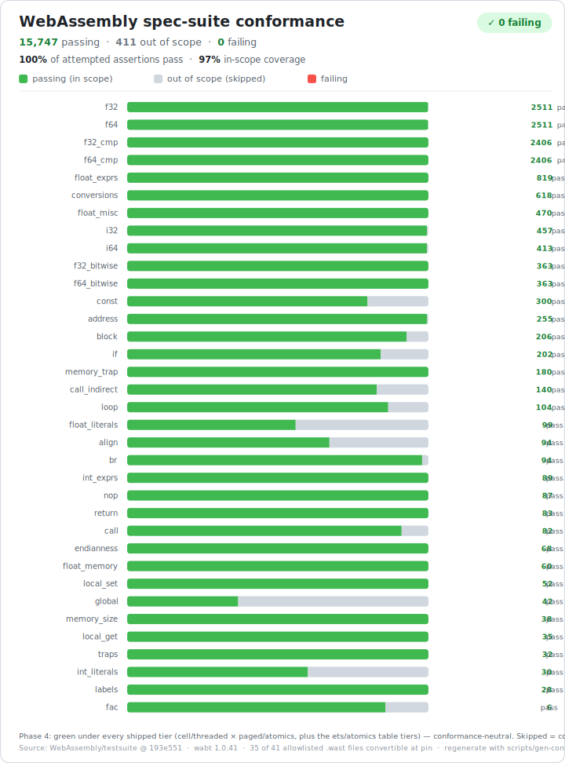

# 2core

> ⚠️ **Experimental.** This is a research project, not a production tool. The
> WebAssembly frontend now compiles end-to-end, but the platform is early and most
> of the roadmap is not built yet. Treat the rest as direction, and check
> [`specs/state.md`](specs/state.md) for exactly what is and isn't done.

**2core is an experiment in compiling code to run fast and _preemptively_ on the BEAM.**

It's a **multi-frontend compiler platform**, written in [Gleam](https://gleam.run), that
lowers several source languages into **one shared, language-neutral intermediate
representation (IR)** and emits **Core Erlang** — so the output runs as ordinary,
fairly-scheduled BEAM code. Loosely: the way Arc runs JavaScript on the BEAM today, but
**compiled rather than interpreted**. The bet is that compiling *to Erlang* — rather than
shipping a long-running interpreter — is what preserves BEAM preemption (even a tight loop
yields fairly and can't monopolise a scheduler) while getting close to native speed.

WebAssembly is the **first** frontend, because so much already compiles *to* WASM —
which transitively brings Rust and (via a JS→WASM compiler) JavaScript along. Native
JavaScript and Gleam/Erlang frontends are planned to follow. The intent is for all of
them to share one IR, one optimizer, one backend, one standard library, and one security
model.

## Status — what works today

**Phases 1 & 2 are complete: essentially all of WebAssembly 1.0 compiles all the way to a
loaded, running `.beam` module** — a real `.wasm` binary goes through a fully modular
`decode → validate → lower → IR → Core Erlang → .beam → instantiate → run` pipeline, in
the sandboxed "Safe" mode, driven by a CLI.

```sh
$ gleam run -- run add.wasm add 2 3     # decode → validate → lower → IR → Core Erlang → .beam → run
5
$ gleam run -- run fib.wasm fib 10
55
$ gleam run -- ir add.wasm              # dump the shared IR in its textual form
module @twocore@wasm@add { … }
```

Every stage is independently invokable (`decode`, `validate`, `lower`, `ir`, `ir-lower`,
`emit`, `to-core`, `build`, `run`), and the whole project builds with **zero warnings**
and **509 passing tests**. What's proven end-to-end:

- **the WASM 1.0 MVP** — integer + control flow (`block`/`loop`/`if`, `br`/`br_table`,
  `call`), **linear memory** (the full load/store matrix, `memory.size`/`grow`,
  bounds-checked → trap), **tables + `call_indirect`** (runtime type-check → trap),
  **globals**, the **full float + conversion** surface, and active data/element/start
  **instantiation**;
- **spec-faithful numerics** *through codegen* — two's-complement wrap, signed/unsigned
  `div`/`rem` + trapping conversions, IEEE floats (round-to-nearest-ties-to-even, canonical
  NaN, the `INT_MIN / -1` / divide-by-zero / out-of-bounds / type-mismatch **traps**);
- **constant-space, preemptible loops** — `sum_to(100000)` runs as a tail-recursive BEAM
  loop without stack growth (even with metering + memory writes in the loop);
- **the sandbox seams** — the `call_host` capability boundary (fail-closed), bounds-checked
  memory with a **grow resource cap**, and `call_indirect` with no ambient authority;
  mutable state is per-instance (one-instance-one-process) and reset on instantiation.

What's deliberately **not** here yet (Phase 3+): reference types, bulk memory, multi-memory,
SIMD, non-function imports; the tier-P "runs-anywhere" build; the WAT text parser; the
optimizer; the "Unsafe" performance profile; and the JS/Rust/Gleam frontends. The full
roadmap and per-component status live in [`specs/state.md`](specs/state.md).

## How it works

- **One shared IR, many frontends.** Every source language lowers into a single,
  **language-neutral** IR (deliberately *not* WASM-shaped) with a canonical textual form
  (`.ir`). Behind it sit one optimizer, one backend, and one runtime — so adding a
  language is "write a frontend," not "rebuild the stack."
- **Structured control → tail-recursive loops.** `block`/`loop`/`if`/`switch` lower to a
  `letrec` of tail-recursive functions; proper BEAM tail calls make loops constant-space
  and preemptible.
- **A dual value model.** A BEAM-native **term** model (for dynamic/term languages) *and*
  an opt-in **fixed-width numeric + linear-memory** model (for WASM/Rust), with explicit
  conversions between them — so term languages don't pay for linear memory, and low-level
  languages keep exact WASM semantics.
- **Safe / Unsafe modes.** Two global modes: **Safe** sandboxes untrusted code (vetted
  in-house stdlib, a tiny allowlist of BEAM functions, deny-all host access, metering on,
  no node-crashing native code); **Unsafe** (later) emits the fastest possible code.
  The two are designed to coexist on one node.
- **Everything modular.** Each stage and runtime layer is a narrow, independently-callable
  interface with interchangeable implementations — the design treats that modularity as
  *both* the security model and the replaceability model.
- **Built in Gleam; output is pure Core Erlang.** The compiler runs at build time on the
  BEAM; whether any native code runs underneath is a per-deployment choice.

The canonical architecture spec is [`specs/00-high-level.md`](specs/00-high-level.md), and
the work is planned as independent units under [`specs/phase-1/`](specs/phase-1/) and
[`specs/phase-2/`](specs/phase-2/).

## Planned frontend roadmap

In intended order (only the first is implemented):

1. **WASM** — *implemented (WASM 1.0).* Also the path to **Rust → BEAM** (via Rust→WASM).
2. **JavaScript via [Porffor](https://github.com/CanadaHonk/porffor)** — a JS→WASM AOT
   compiler feeding the WASM frontend, as an early proof-of-concept.
3. **Arc as a native JavaScript frontend** — emitting the IR directly (term value model)
   rather than boxing JS through linear memory.
4. **Erlang / Gleam frontend** — write Gleam, deploy to the platform, and (via Safe mode)
   be provably unable to take over the VM.

## WebAssembly conformance

The WASM frontend is differential-tested against the official
[WebAssembly spec test suite](https://github.com/WebAssembly/testsuite) (pinned), run
through the real compile-and-execute pipeline. Of the assertions we attempt, **100% pass
and 0 fail** (15,747 passing), and in-scope coverage of the MVP suite is now **~97%**; the
remaining "out of scope" share is spec coverage for post-MVP proposals the platform doesn't
target yet (reference types, bulk/multi-memory, SIMD).

<p align="center">
  
</p>

> Regenerate with `scripts/gen-conformance-svg.sh` (run `RUN_VENDOR=1 …` to fetch the full
> pinned fixture set first). The image reflects the full allowlist; a fresh checkout ships
> only a small committed fixture subset, so `gleam test` runs green without re-vendoring.

## Development

Requires the standard Gleam toolchain — **Gleam 1.17+**, Erlang/OTP 29. For the full
conformance run you also need **wabt** (`wat2wasm`/`wast2json`/`spectest-interp`).

```sh
gleam test                      # run all tests (unit + the committed conformance subset)
gleam format --check src test   # CI requires this
gleam run -- run mod.wasm fn a b   # compile a .wasm and invoke an export on the BEAM
gleam run -- ir mod.wasm           # dump the shared IR (.ir text)

# Full WASM spec-suite conformance (clones the pinned testsuite, needs wabt + network):
bash test/twocore/conformance/vendor/vendor.sh && gleam test
```

See [`CLAUDE.md`](CLAUDE.md) for contributor conventions (definition of done, testing
against the spec, commit rules).

## Specification

- [`specs/00-high-level.md`](specs/00-high-level.md) — the canonical architecture spec
  (the IR, the layer map, the security model).
- [`specs/state.md`](specs/state.md) — the live status ledger: every component, what's
  done, and what each leaves for the next.
- [`specs/phase-1/`](specs/phase-1/) — the Phase-1 work breakdown, one unit per file.
